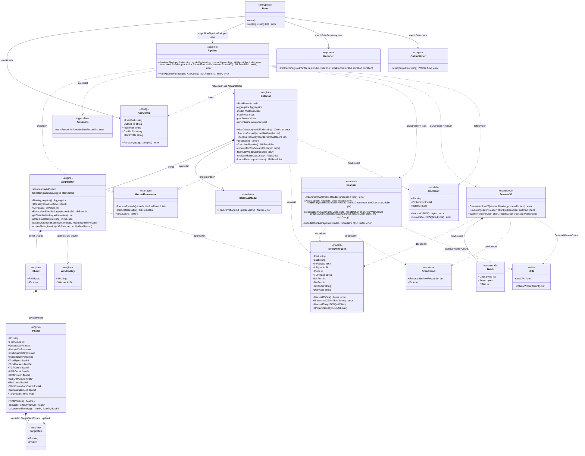

```mermaid
classDiagram

    %% ── models ──────────────────────────────────────────────────
    class NetflowRecord {
        <<models>>
        +First     string
        +Last      string
        +InPackets int64
        +InBytes   int64
        +Proto     int
        +TCPFlags  string
        +SrcPort   int
        +DstPort   int
        +Src4Addr  string
        +Dst4Addr  string
        +MarshalJSON() bytes, error
        +UnmarshalJSON(data bytes) error
        +MarshalEasyJSON(w Writer)
        +UnmarshalEasyJSON(l Lexer)
    }

    class MLResult {
        <<models>>
        +IP          string
        +Probability float64
        +IsBotnet    bool
        +MarshalJSON() bytes, error
        +UnmarshalJSON(data bytes) error
    }

    class ScanResult {
        <<models>>
        +Records NetflowRecord list ptr
        +Err     error
    }

    %% ── engine ──────────────────────────────────────────────────
    class TargetKey {
        <<engine>>
        +IP   string
        +Port int
    }

    class WindowKey {
        <<engine>>
        +IP     string
        +Window int64
    }

    class IPStats {
        <<engine>>
        +IP                 string
        +FlowCount          int
        +UniqueDstIPs       map
        +UniqueDstPorts     map
        +OutboundDstPorts   map
        +InboundDstPorts    map
        +TotalBytes         float64
        +TotalPackets       float64
        +TCPCount           float64
        +UDPCount           float64
        +ICMPCount          float64
        +SynOnlyCount       float64
        +RstCount           float64
        +WellKnownPortCount float64
        +SumDurationSec     float64
        +TargetStartTimes   map
        +ToMLVector() float64s
        -calculatePortSymmetry() float64
        -calculateIATMetrics() float64, float64, float64
    }

    class Shard {
        <<engine>>
        +RWMutex
        +IPs map
    }

    class Aggregator {
        <<engine>>
        -shards array64Shard
        -timestampWarningLogged atomicBool
        +NewAggregator() Aggregator
        +Update(record NetflowRecord)
        +AllIPStats() IPStats list
        +ExtractAndFlushBefore(window int64) IPStats list
        -getShardIndex(key WindowKey) int
        -parseTimestamp(s string) time, bool
        -updateOutboundStats(stats IPStats, record NetflowRecord)
        -updateTimingMetrics(s IPStats, record NetflowRecord)
    }

    class XGBoostModel {
        <<interface>>
        +PredictProba(input SparseMatrix) Matrix, error
    }

    class Detector {
        <<engine>>
        +TotalRecords  int64
        -aggregator    Aggregator
        -model         XGBoostModel
        -maxProbs      map
        -probMutex     Mutex
        -currentWindow atomicInt64
        +NewDetector(modelPath string) Detector, error
        +ProcessRecord(record NetflowRecord)
        +ProcessRecords(records NetflowRecord list)
        +TotalCount() int64
        +CalculateResults() MLResult list
        -updateMaxWindowAndFlush(win int64)
        -flushOldWindows(threshold int64)
        -evaluateBatch(statsBatch IPStats list)
        -formatResults(probs map) MLResult list
    }

    %% ── scanner ─────────────────────────────────────────────────


    class Scanner {
        <<scanner>>
        +StreamNetflow(stream Reader, processFn func) error
        -isArray(stream Reader) bool, Reader, error
        -readjsonByDelimiter(reader Reader, chunksChan chan, errChan chan, delim byte)
        -processJsonArray(chunksChan chan, resultsChan chan, wg WaitGroup)
        -processJsonLines(chunksChan chan, resultsChan chan, wg WaitGroup)
        -decodeChunkArray(chunk bytes, recordsPtr ptr) Buffer, error
    }

    %% ── scannerv2 ───────────────────────────────────────────────
    class Batch {
        <<scannerv2>>
        +Lines  bytes list
        +Arena  bytes
        +Offset int
    }


    class ScannerV2 {
        <<scannerv2>>
        +StreamNetflowV2(stream Reader, processFn func) error
        +Producer(reader Reader, chunksChan chan, errChan chan)
        +Worker(chunksChan chan, resultsChan chan, wg WaitGroup)
    }

    %% ── pipeline ────────────────────────────────────────────────
    class RecordProcessor {
        <<interface>>
        +ProcessRecords(records NetflowRecord list)
        +CalculateResults() MLResult list
        +TotalCount() int64
    }

    class StreamFn {
        <<type alias>>
        func r Reader fn func NetflowRecord list error
    }

    class Pipeline {
        <<pipeline>>
        +AnalyzeFile(inputPath string, modelPath string, stream StreamFn) MLResult list, int64, error
        -execute(r Reader, processor RecordProcessor, stream StreamFn) MLResult list, int64, error
        +RunPipelineForInput(cfg AppConfig) MLResult list, int64, error
    }

    %% ── config ──────────────────────────────────────────────────
    class AppConfig {
        <<config>>
        +ModelPath  string
        +OutputFile string
        +InputPath  string
        +CpuProfile string
        +MemProfile string
        +ParseArgs(args string list) error
    }

    %% ── reporter ────────────────────────────────────────────────
    class Reporter {
        <<reporter>>
        +PrintSummary(out Writer, results MLResult list, totalRecords int64, duration Duration)
    }

    %% ── output ──────────────────────────────────────────────────
    class OutputWriter {
        <<output>>
        +Setup(outputFile string) Writer, func, error
    }

    %% ── utils ───────────────────────────────────────────────────
    class Utils {
        <<utils>>
        -numCPU func
        +OptimalWorkerCount() int
    }

    %% ── main ────────────────────────────────────────────────────
    class Main {
        <<entrypoint>>
        +main()
        +run(args string list) error
    }

    %% ── RELATIES ────────────────────────────────────────────────

    %% Composition: engine intern
    Aggregator "1" *-- "64" Shard : bevat shards
    Shard "1" *-- "*" IPStats : bevat IPStats
    IPStats "1" *-- "*" TargetKey : sleutel in TargetStartTimes
    Aggregator ..> WindowKey : gebruikt als sleutel
    Detector "1" *-- "1" Aggregator : owns
    Detector "1" --> "1" XGBoostModel : injecteert

    %% Interface implementaties
    Detector ..|> RecordProcessor : implementeert

    %% engine → models
    Detector ..> NetflowRecord : verwerkt
    Detector ..> MLResult : produceert
    Aggregator ..> NetflowRecord : aggregeert
    IPStats ..> TargetKey : gebruikt

    %% scanner → models + utils
    Scanner ..> NetflowRecord : decodeert
    Scanner ..> ScanResult : produceert
    Scanner ..> Utils : OptimalWorkerCount
    ScannerV2 ..> NetflowRecord : decodeert
    ScannerV2 "1" *-- "*" Batch : produceert
    ScannerV2 ..> ScanResult : produceert
    ScannerV2 ..> Utils : OptimalWorkerCount

    %% pipeline
    Pipeline ..> RecordProcessor : injecteert
    Pipeline ..> StreamFn : injecteert
    Pipeline ..> Detector : maakt aan via NewDetector
    Pipeline ..> AppConfig : leest
    Pipeline ..> Scanner : als StreamFn json
    Pipeline ..> ScannerV2 : als StreamFn ndjson
    Pipeline ..> MLResult : retourneert

    %% main → rest
    Main --> AppConfig : maakt aan
    Main --> Pipeline : roept RunPipelineForInput aan
    Main --> Reporter : roept PrintSummary aan
    Main --> OutputWriter : roept Setup aan
```
