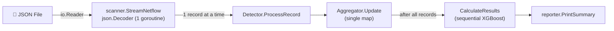
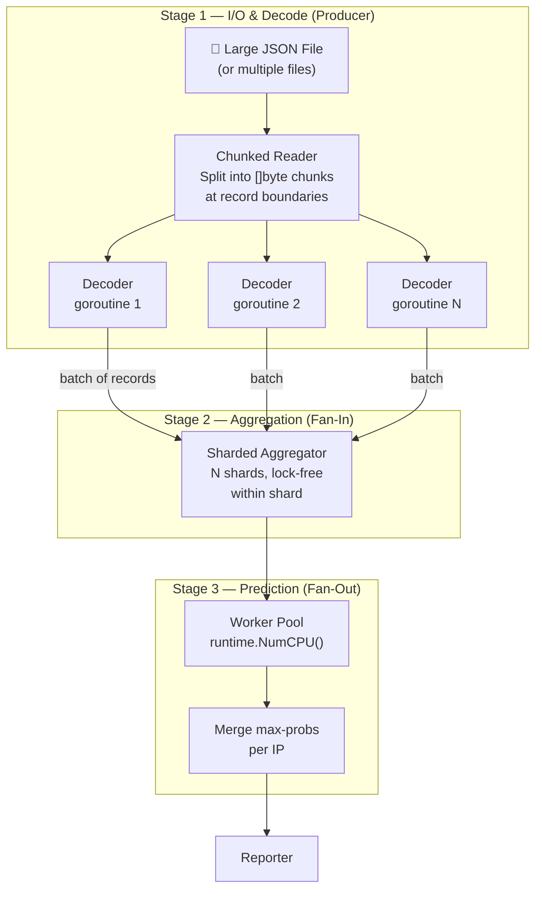

# Concurrency Optimization Plan — GoVersionML

> Goal: Make the pipeline capable of processing **terabytes** of netflow JSON as fast as possible, fully utilizing available CPU cores and memory.

---

## Current Architecture (Single-Threaded)



**Every stage runs in a single goroutine.** The bottlenecks, in order of severity:

| # | Bottleneck | Why It Hurts |
|---|-----------|-------------|
| 1 | **JSON decoding** (`scanner.go`) | `encoding/json` is notoriously slow; single-threaded on one core |
| 2 | **Aggregator map** (`aggregator.go`) | Single `map[string]*IPStats` — all writes serialize behind one goroutine |
| 3 | **XGBoost prediction** (`detector.go`) | `CalculateResults` iterates all IPs sequentially, calling `predictProbability` one-by-one |
| 4 | **Memory** | `map[string]bool` for sets wastes ~100× vs bitsets; no way to cap memory growth |

---

## Proposed Concurrent Architecture



---

## Detailed Changes Per File

### Phase 1 — Parallel JSON Decoding

#### [MODIFY] [scanner.go](file:///c:/Users/rick_/Documents/GitHub/Allesvoordeblauw/GoVersionML/scanner/scanner.go)

The current `json.NewDecoder` reads one record at a time on a single core. For TB-scale data this is the #1 bottleneck.

**Strategy: Chunk-and-Decode**

1. **Read raw bytes in large blocks** (e.g. 8–16 MB) from the file with `io.Reader`.
2. **Find a clean record boundary** in each block (scan backwards for `},` or `}]` to avoid splitting a JSON object mid-field).
3. **Fan out** each chunk to a pool of `N` goroutines that each run their own `json.Decoder` on a `bytes.Reader`.
4. Each decoder goroutine writes **batches** of `[]NetflowRecord` (e.g. 4096 records) into a **buffered channel**.

```go
// Pseudocode
func StreamNetflowParallel(r io.Reader, batchSize int, out chan<- []models.NetflowRecord) error {
    chunks := splitIntoChunks(r, 8*1024*1024) // 8 MB chunks
    var wg sync.WaitGroup
    sem := make(chan struct{}, runtime.NumCPU()) // limit concurrency

    for chunk := range chunks {
        sem <- struct{}{}
        wg.Add(1)
        go func(data []byte) {
            defer wg.Done()
            defer func() { <-sem }()
            dec := json.NewDecoder(bytes.NewReader(data))
            batch := make([]models.NetflowRecord, 0, batchSize)
            for dec.More() {
                var rec models.NetflowRecord
                dec.Decode(&rec)
                batch = append(batch, rec)
                if len(batch) >= batchSize {
                    out <- batch
                    batch = make([]models.NetflowRecord, 0, batchSize)
                }
            }
            if len(batch) > 0 { out <- batch }
        }(chunk)
    }
    wg.Wait()
    close(out)
}
```

> [!TIP]
> Consider using **`github.com/goccy/go-json`** or **`github.com/json-iterator/go`** as drop-in replacements for `encoding/json` — they are 2–5× faster with zero API changes.

> [!IMPORTANT]
> **Record ordering is NOT required** for this workload. Aggregation is commutative (sums, sets, counts), so out-of-order processing is safe. The only ordering dependency is IAT (inter-arrival time) tracking, but that is handled post-hoc via `sort.Float64s(times)` in `calculateIATMetrics`, which already assumes unordered input.

---

### Phase 2 — Sharded Aggregator

#### [MODIFY] [aggregator.go](file:///c:/Users/rick_/Documents/GitHub/Allesvoordeblauw/GoVersionML/engine/aggregator.go)

The single `map[string]*IPStats` is a contention hotspot with multiple writers. Use a **sharded map** pattern:

**Strategy: N shards, hash-based routing**

```go
const numShards = 64 // power of 2, tune to core count

type ShardedAggregator struct {
    shards [numShards]struct {
        sync.Mutex
        ips map[string]*IPStats
    }
}

func (sa *ShardedAggregator) getShard(key string) int {
    h := fnv.New32a()
    h.Write([]byte(key))
    return int(h.Sum32()) & (numShards - 1)
}

func (sa *ShardedAggregator) Update(record models.NetflowRecord) {
    // Route to shard by src IP time-window key
    // Each shard has its own lock → minimal contention
    key := getTimeWindowKey(record.Src4Addr, ...)
    idx := sa.getShard(key)
    sa.shards[idx].Lock()
    // ...update stats...
    sa.shards[idx].Unlock()
}
```

**Why sharding over `sync.Map`:** `sync.Map` is optimized for read-heavy workloads. Our workload is **write-heavy** (every record mutates the map), so explicit sharding gives us much better throughput.

**Additional memory optimizations inside `IPStats`:**

| Current | Proposed | Savings |
|---------|----------|---------|
| `map[string]bool` for `UniqueDstIPs` | `map[string]struct{}` | ~8 bytes per entry (bool=1 byte in map → 0 bytes for empty struct) |
| `map[int]bool` for port tracking | `map[int]struct{}` | Same optimization |
| `fmt.Sprintf` for `getTimeWindowKey` | Pre-split by IP then timestamp | Avoid string alloc per record |

> [!NOTE]
> The `timestampWarningLogged` **package-level bool** on line 14 of `aggregator.go` is a **data race** if multiple goroutines call `parseTimestamp`. Fix with `sync.Once` or `atomic.Bool`.

---

### Phase 3 — Parallel XGBoost Prediction

#### [MODIFY] [detector.go](file:///c:/Users/rick_/Documents/GitHub/Allesvoordeblauw/GoVersionML/engine/detector.go)

`CalculateResults` currently loops through all IP stats sequentially. This is embarrassingly parallel.

**Strategy: Worker Pool with `sync.WaitGroup`**

```go
func (d *Detector) CalculateResults() []models.MLResult {
    type ipProb struct {
        ip   string
        prob float64
    }

    resultsCh := make(chan ipProb, 1024)
    var wg sync.WaitGroup
    sem := make(chan struct{}, runtime.NumCPU())

    // Fan-out: predict in parallel
    for _, stats := range d.aggregator.AllIPStats() {
        wg.Add(1)
        sem <- struct{}{}
        go func(s *IPStats) {
            defer wg.Done()
            defer func() { <-sem }()
            features := s.ToMLVector()
            prob, err := d.predictProbability(features)
            if err == nil {
                resultsCh <- ipProb{s.IP, prob}
            }
        }(stats)
    }

    go func() { wg.Wait(); close(resultsCh) }()

    // Fan-in: collect max probs
    maxProbs := make(map[string]float64)
    for r := range resultsCh {
        if cur, ok := maxProbs[r.ip]; !ok || r.prob > cur {
            maxProbs[r.ip] = r.prob
        }
    }

    return d.formatResults(maxProbs)
}
```

> [!IMPORTANT]
> Verify that `d.model.PredictProba()` from the `xgboost-go` library is **thread-safe for reads**. XGBoost models are typically read-only after loading, so concurrent prediction calls should be safe. Confirm by checking the library source or running `go test -race`.

---

### Phase 4 — Pipeline Orchestration

#### [MODIFY] [main.go](file:///c:/Users/rick_/Documents/GitHub/Allesvoordeblauw/GoVersionML/main.go)

Wire the stages together as a **pipeline**:

```go
func run() error {
    // ...config & output setup unchanged...

    detector := engine.NewDetector(appConfig.ModelPath)

    // Stage 1: Decode → channel of batches
    batchCh := make(chan []models.NetflowRecord, runtime.NumCPU()*2)
    var decodeErr error
    go func() {
        decodeErr = ingest.ProcessInputParallel(appConfig.NetflowPath, batchCh)
    }()

    // Stage 2: Aggregate from batches (multiple consumer goroutines)
    detector.ProcessBatches(batchCh)

    if decodeErr != nil {
        return fmt.Errorf("scanning input: %w", decodeErr)
    }

    // Stage 3: Predict in parallel
    results := detector.CalculateResults()

    // Stage 4: Report (unchanged, runs once at the end)
    reporter.PrintSummary(out, results, detector.TotalRecords, time.Since(start))
    return nil
}
```

#### [MODIFY] [ingest.go](file:///c:/Users/rick_/Documents/GitHub/Allesvoordeblauw/GoVersionML/ingest/ingest.go)

Add a new `ProcessInputParallel` function that returns a channel, keeping the old `ProcessInput` as a fallback.

---

### Phase 5 — Memory Management & Back-Pressure

For terabyte-scale data, uncontrolled goroutine spawning = OOM crash. Key safeguards:

| Mechanism | Where | How |
|-----------|-------|-----|
| **Buffered channels** | Between stages | `make(chan []Record, N)` — producers block when consumers are slow |
| **Semaphore** | Decoder pool, predictor pool | `sem := make(chan struct{}, runtime.NumCPU())` limits concurrency |
| **Batch processing** | Everywhere | Process 4096 records at a time, not one-by-one — amortizes channel overhead and allocation |
| **Object pooling** | Record slices | `sync.Pool` for `[]NetflowRecord` batches to reduce GC pressure |
| **GOGC tuning** | At startup | Set `GOGC=200` or higher via `debug.SetGCPercent()` — trades memory for fewer GC pauses |

```go
var recordBatchPool = sync.Pool{
    New: func() any {
        s := make([]models.NetflowRecord, 0, 4096)
        return &s
    },
}
```

---

### Phase 6 — Multiple Input Files (Bonus)

#### [MODIFY] [config.go](file:///c:/Users/rick_/Documents/GitHub/Allesvoordeblauw/GoVersionML/config/config.go)

Remove the `"You are not allowed to specify multiple files"` restriction. Accept `flag.Args()` as a slice:

```go
type AppConfig struct {
    ModelPath    string
    OutputFile   string
    NetflowPaths []string  // plural
    Workers      int       // new: -w flag for manual core override
}
```

This lets you process multiple files in parallel — one goroutine per file feeding the same sharded aggregator. Perfect for when TB of data is split across multiple netflow exports.

---

## Summary: What Changes and What Doesn't

| File | Changes |
|------|---------|
| [scanner.go](file:///c:/Users/rick_/Documents/GitHub/Allesvoordeblauw/GoVersionML/scanner/scanner.go) | Add chunked parallel decoding, keep old function |
| [aggregator.go](file:///c:/Users/rick_/Documents/GitHub/Allesvoordeblauw/GoVersionML/engine/aggregator.go) | Sharded map, `map[x]struct{}`, fix data race on `timestampWarningLogged`, `sync.Pool` for batches |
| [detector.go](file:///c:/Users/rick_/Documents/GitHub/Allesvoordeblauw/GoVersionML/engine/detector.go) | Parallel prediction with worker pool, atomic `TotalRecords` |
| [main.go](file:///c:/Users/rick_/Documents/GitHub/Allesvoordeblauw/GoVersionML/main.go) | Pipeline wiring with channels between stages |
| [ingest.go](file:///c:/Users/rick_/Documents/GitHub/Allesvoordeblauw/GoVersionML/ingest/ingest.go) | New `ProcessInputParallel` returning channel |
| [config.go](file:///c:/Users/rick_/Documents/GitHub/Allesvoordeblauw/GoVersionML/config/config.go) | Multi-file support, `-w` workers flag |
| [models.go](file:///c:/Users/rick_/Documents/GitHub/Allesvoordeblauw/GoVersionML/models/models.go) | **No changes** |
| [reporter.go](file:///c:/Users/rick_/Documents/GitHub/Allesvoordeblauw/GoVersionML/reporter/reporter.go) | **No changes** (runs once at the end, not a bottleneck) |
| [writer.go](file:///c:/Users/rick_/Documents/GitHub/Allesvoordeblauw/GoVersionML/output/writer.go) | **No changes** |

---

## Verification Plan

### Correctness — Race Detector
```bash
go test -race ./...
go build -race -o goversion_race.exe .
./goversion_race.exe test_netflow.json
```
The Go race detector will catch any data races we've introduced.

### Correctness — Output Comparison
1. Run the **current** single-threaded version → save results to `results_baseline.txt`
2. Run the **concurrent** version → save results to `results_concurrent.txt`
3. Compare: the exact same IPs should be flagged with the same probabilities (floating-point identical, since the math doesn't change)

### Performance — Benchmarking
```bash
# Benchmark current version
time ./goversion.exe -o results_baseline.txt test_netflow.json

# Benchmark concurrent version
time ./goversion_concurrent.exe -o results_concurrent.txt test_netflow.json
```

### Manual Verification
- The user should test with the existing `test_netflow.json` (178 MB) and confirm identical output
- If larger datasets are available, test with those to see scaling behavior

> [!CAUTION]
> There are currently **no unit tests** in this codebase. Before making these changes, it would be wise to add baseline tests for `Aggregator.Update`, `ToMLVector`, and `predictProbability` to catch regressions. These don't need concurrency — just golden-value tests.
